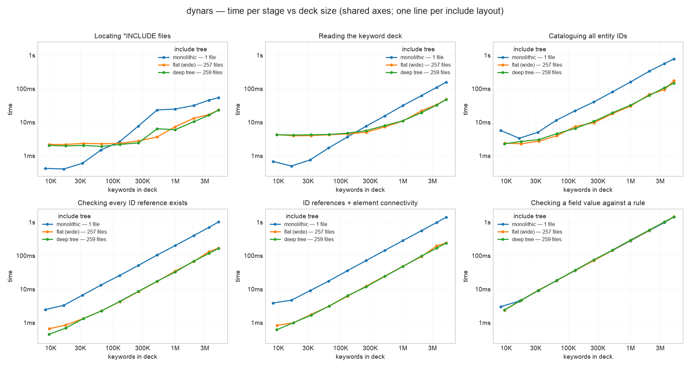
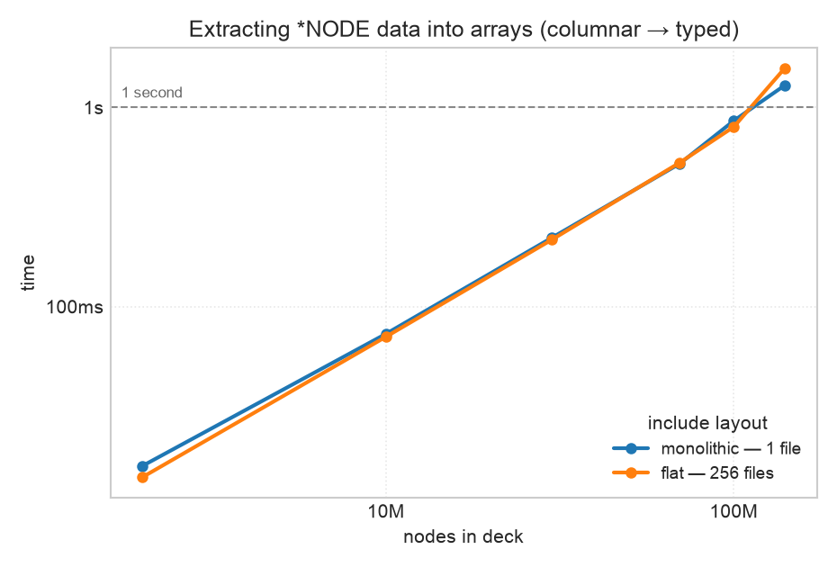

<p align="center">
  <picture>
    <source media="(prefers-color-scheme: dark)" srcset="assets/logo-dark.png">
    
  </picture>
</p>

<p align="center">
  <a href="https://osullivryan.github.io/dynars/"><b>Documentation</b></a> ·
  <a href="https://osullivryan.github.io/dynars/rust/dynars/">Rust API</a> ·
  <a href="https://osullivryan.github.io/dynars/python/dynars.html">Python API</a>
</p>

High-performance LS-DYNA keyword file parser, written in Rust with first-class
Python bindings.

`dynars` does two things, both built for very large decks:

1. **Include-tree scanning** — walk a deck's `*INCLUDE` graph across many files,
   in parallel, at memory-bandwidth speed.
2. **Keyword marshalling** — index a file into keyword blocks, read the
   high-volume keywords (`*NODE`, `*ELEMENT_*`) as columnar numpy arrays, edit
   individual keywords, and write the deck back.

## Highlights

- **Fast.** The `*INCLUDE` scanner runs at ~15 GB/s per core (SIMD `memchr`);
  cross-file work is spread over all cores. Node marshalling parses ~73 M
  nodes/s across 10 cores.
- **Zero-copy to numpy.** Numeric schema columns (node coords, element
  connectivity, …) cross the FFI boundary as numpy arrays without a copy.
- **Handles the awkward formats.** Fixed-width (8-col), long (`*KEYWORD LONG`),
  and free (comma-separated) cards; Fortran float quirks (`1.5D+3`, `1.234-5`).
- **Callable from C and Fortran.** The deck parse + validate path is exposed
  over a C ABI (opt-in `ffi` feature); Fortran binds it via `iso_c_binding`.
  See [C / Fortran API](#c--fortran-api).
- **Batch-aware.** A `Workspace` parses and validates many decks that share
  `*INCLUDE`s against one cache — a common mesh is read, parsed, and indexed once,
  not once per deck (up to ~12× over a 32-deck batch). See
  [Workspace](#workspace-batch-decks-that-share-includes).

## Installation

```bash
pip install dynars        # Python package (pulls in numpy)
cargo add dynars          # Rust library
cargo install dynars      # the `dynars` CLI
```

## Command-line usage

```bash
# Parse a deck and print the include tree + throughput
dynars parse root.k

# ...as structured JSON instead (pipe to jq, feed a pipeline, etc.)
dynars parse root.k --json

# Generate a synthetic deck for benchmarking
dynars generate --depth 6 --breadth 4 --nodes 100000 --output test_output
```

## Python API

### Include tree

```python
import dynars

root = dynars.parse_include_tree("root.k")
print(root.total_files(), root.total_bytes())
for child in root.children:
    print(child.path, child.kind, child.byte_count)
```

### Keyword marshalling

```python
import dynars

kf = dynars.parse_keyword_file("deck.k")
print(kf.num_blocks, kf.block_names())

# Columnar geometry via a schema (see "User-defined keyword schemas" below)
nodes = dynars.parse_keyword(kf, "NODE")   # {"nid": int64[N], "x": ..., ...}

# Generic access + edit for any of the ~2000 keywords
i = kf.block_names().index("MAT_ELASTIC")
kw = kf.keyword(i)                      # {"name", "options", "cards"}
kw_cards = kw["cards"]
kw_cards[0][2] = "70000.0"              # change Young's modulus
kf.set_keyword(i, "MAT_ELASTIC", kw_cards)

raw = kf.to_bytes()                     # the (edited) deck as bytes
kf.write("deck_edited.k")
```

### Deck: navigate and bulk-read off one handle

`parse_deck` parses the root and every `*INCLUDE` once. The resulting `Deck` is
the single handle for both **navigation** (by id / kind, following references)
and **bulk columnar** reads — include-aware, so columns span every file:

```python
import dynars

deck = dynars.parse_deck("root.k")

# Bulk columns across the whole deck (root + includes), via built-in schemas:
nodes = deck.table("NODE")             # {"nid": int64[N], "x": ..., ...}
shells = deck.table("ELEMENT_SHELL")   # {"eid", "pid", "nodes": int64[N, 4]}

# Same handle, navigate by id and follow references:
part = deck.part(1)
mat = part.material()
print(part.field("secid"), mat.id if mat else None)
```

The equivalent in Rust — the columnar fast path and occurrence navigation share
one vocabulary (keyword names, field names) over the same `Deck`:

```rust
use dynars::deck::parse_deck;

let deck = parse_deck(std::path::Path::new("root.k")).unwrap();

// Bulk columns across the whole deck:
let nodes = deck.table("NODE").unwrap();
let ids = nodes.column("nid").unwrap().as_int().unwrap();

// Navigate the same handle; per-row typed field access:
if let Some(part) = deck.part(1) {
    let secid = part.field("secid").and_then(|f| f.as_i64());
    let mat_id = part.material().and_then(|m| m.id());
    let _ = (ids, secid, mat_id);
}
```

### Validation & checks

Rules run over a parsed `Deck`, reusing the parse and fanning out across cores.
There's **no default rule set** — you pass exactly the checks you want and get
back a report of findings, each with a clickable `file:line`.

```python
import dynars
from dynars import Rule, Predicate, Cmp, Severity

deck = dynars.parse_deck("root.k")

report = deck.validate([
    Rule.references_resolve(),                                # every id reference resolves
    Rule.duplicate_ids(),                                     # no two entities share an id
    Rule.unreferenced_entities(),                             # dead *MAT/*SET/*DEFINE_CURVE/... (warns)
    Rule.field_forbidden_values("MAT_ELASTIC", "PR", [0.5]),  # PR may not be 0.5
    Rule.field_required(                                      # if ELFORM==2, NIP must be > 0
        "SECTION_SHELL",
        require=Predicate.field("NIP", Cmp.Gt, 0),
        when=Predicate.field("ELFORM", Cmp.Eq, 2),
    ),
    Rule.keyword_forbidden("MAT_ADD_EROSION").only_in(["submodel/"]),  # scope to some files
])

print(report.is_clean(), report.count(Severity.Error))
for f in report.findings:
    print(f.severity, f.rule, f.location(), "-", f.message)
```

Built-in rules: `references_resolve()` / `references_resolve_with_connectivity()`
(the latter also checks every element's nodes exist — heavy on big meshes),
`duplicate_ids()` (two entities of the same kind claiming one id — logical, so
`*INCLUDE_TRANSFORM` instances don't collide), `unreferenced_entities()` (dead
library definitions — unused `*MAT`/`*SECTION`/`*DEFINE_CURVE`/`*SET`/…, at
`Warning`), `rigid_context()` (rigid-body keywords like `*LOAD_RIGID_BODY` /
`*CONSTRAINED_RIGID_BODIES` must target a `*MAT_RIGID` part),
`field_forbidden_values`, `field_required`, `keyword_forbidden`,
`include_missing`. Every rule takes `.only_in([...])` / `.except_in([...])` file
scopes and `.with_severity(Severity.Warning)`; compose predicates with
`Predicate.all_ / any_ / not_`.

Rust runs the same rules, plus a **custom `Check`** for anything the built-ins
don't cover — implement one trait, wrap it in `Rule::custom`:

```rust
use dynars::deck::parse_deck;
use dynars::validate::{Rule, Cmp, Expr, Value, Severity, Check, Deck, Finding};

let deck = parse_deck(std::path::Path::new("root.k")).unwrap();

let report = deck.validate([
    Rule::references_resolve(),
    Rule::field_forbidden_values("MAT_ELASTIC", "PR", [Value::Float(0.5)]),
    Rule::field_required(
        "SECTION_SHELL",
        Some(Expr::field("ELFORM", Cmp::Eq, Value::Int(2))),   // when
        Expr::field("NIP", Cmp::Gt, Value::Int(0)),            // require
    ),
]);
println!("{} error(s)", report.count(Severity::Error));

// Arbitrary logic: any struct implementing Check becomes a rule.
struct DensityPositive;
impl Check for DensityPositive {
    fn name(&self) -> String { "density_positive".into() }
    fn run(&self, deck: &Deck) -> Vec<Finding> {
        deck.keywords("MAT_ELASTIC").filter_map(|m| {
            let ro = m.field("RO")?.as_f64()?;
            (ro <= 0.0).then(|| Finding {
                rule: self.name(), severity: Severity::Warning,
                keyword: "MAT_ELASTIC".into(), file: m.file().to_path_buf(),
                line: m.line(), message: format!("RO = {ro} must be positive"),
            })
        }).collect()
    }
}
let _ = deck.validate([Rule::custom(DensityPositive)]);
```

### Workspace: batch decks that share includes

Checking many decks — load-case or run variants of one model — usually means they
all `*INCLUDE` the same big files (mesh, materials, sections). A `Workspace` reads,
parses, and indexes each shared file **once** across the whole batch, then
validates the decks in parallel. The decks it hands back are ordinary `Deck`s —
navigate or validate them individually too; either way they reuse the shared cache.

```python
import dynars

ws = dynars.Workspace()
decks = ws.parse_decks(["variant_a/main.k", "variant_b/main.k", "variant_c/main.k"])

reports = ws.validate_decks(decks, [
    dynars.Rule.references_resolve_with_connectivity(),
    dynars.Rule.duplicate_ids(),
])
for report in reports:
    print(report.is_clean(), report.count(dynars.Severity.Error))

# A shared mesh is read once and its id/connectivity indices built once, not per deck:
print(ws.stats())  # {'files_parsed': 4, 'files_reused': 2, 'def_indices_built': 4, ...}
```

```rust
use dynars::Workspace;
use dynars::validate::Rule;

let ws = Workspace::new();
let decks: Vec<_> = ws
    .parse_decks(["variant_a/main.k", "variant_b/main.k"])
    .into_iter()
    .filter_map(|(_root, d)| d.ok())
    .collect();

let reports = ws.validate_decks(&decks, [
    Rule::references_resolve_with_connectivity(),
    Rule::duplicate_ids(),
]);
```

> **Missing includes.** A missing `*INCLUDE` is never parsed — it adds no file and
> no cached content (`files_parsed` doesn't count it), so nothing phantom leaks
> into the deck. Add `Rule.include_missing()` to catch it explicitly; don't rely
> on `references_resolve` alone, because if the missing file was the *only* source
> of an entity kind, references to that kind are left unflagged (the dangling
> check is conservative by design).

The shared work is paid once and amortizes over the batch, so the workspace total
stays roughly flat as decks are added while the naive per-deck approach grows
linearly. Over a 28 MB shared mesh (500k nodes / 500k shells), naive `parse_deck`
+ `validate` per deck vs. `Workspace` (`examples/batch_bench.rs`, or
`examples/batch_bench.py` — build the extension `--release` first):

| decks | naive total | workspace total | speedup |
|------:|------------:|----------------:|--------:|
| 4  | 240 ms  | 122 ms | 2.0× |
| 8  | 481 ms  | 126 ms | 3.8× |
| 16 | 969 ms  | 150 ms | 6.5× |
| 32 | 1944 ms | 157 ms | 12.4× |

Runnable walk-throughs: `examples/batch_validate.rs` / `examples/batch_demo.py`.

### Result post-processing

Channels read from a binout/d3plot come back as numpy arrays, so they chain
straight into signal processing and occupant injury criteria — implemented in the
Rust core (and so available to the C/Fortran bindings too), verified bit-exact
against SciPy.

```python
import numpy as np
import dynars

b = dynars.parse_binout("binout*")
dt = 1e-4  # s

# SAE J211 CFC filtering (zero-phase) — the phaseless Butterworth crash analysts need
ax = dynars.cfc(b.read(["nodout", "d000001", "x_acceleration"]), 1000.0, dt)  # CFC1000
# general zero-phase Butterworth, plus integrate / differentiate
vel = dynars.integrate(ax, dt)                      # accel -> velocity
low = dynars.butterworth(ax, 4, 300.0, 1/dt, "low")

# occupant injury criteria (acceleration in g)
a_res = dynars.resultant(ax_g, ay_g, az_g)          # sqrt(x^2+y^2+z^2)
hic36 = dynars.hic36(a_res, dt)                     # Head Injury Criterion (also hic15, hic)
a3ms  = dynars.clip(a_res, dt)                      # 3 ms clip (window defaults to 3 ms)
csi   = dynars.severity_index(a_res, dt)           # Gadd severity index
```

Filtering (`cfc`, `filtfilt`, `butterworth`) is behind the `signal` feature —
folded into the Python build; CFC + injury criteria are pure and always available.
Generic array math (FFT, resampling, custom filters) is left to numpy/SciPy.

### Extending: keywords dynars doesn't ship

Decks carry vendor, rare, or newer-than-our-snapshot keywords. Describe one once
with a schema and it becomes first-class on the deck — no fork in the API.

In **Rust** the schema also declares references (`Card::ref_to`), so the
registered keyword navigates, its fields type, and its references are
dangling-checked like any built-in:

```rust
use dynars::schema::{Schema, Card};
use dynars::keywords::EntityKind;
use dynars::validate::Rule;

// `deck` must be `let mut` to register.
deck.register_schema(Schema::new("VENDOR_WIDGET").card(
    Card::new()
        .int("wid", 8)
        .float("mass", 8)
        .ref_to("mat", 8, EntityKind::Material),   // id references a *MAT
));

// Navigate + typed field access, exactly like a built-in keyword:
let w = deck.keywords("VENDOR_WIDGET").next().unwrap();
let mass = w.card(0).and_then(|c| c.field("mass")).and_then(|f| f.as_f64());
let mat  = w.card(0).and_then(|c| c.field("mat")).and_then(|f| f.reference());

// references_resolve() now dangling-checks VENDOR_WIDGET.mat -> *MAT:
let report = deck.validate([Rule::references_resolve()]);
```

In **Python**, register a schema (cards are `(name, type, width, count)` tuples)
so the validation rules can target the keyword; read its columns with
`table_with`:

```python
deck = dynars.parse_deck("root.k")
cards = [[("wid", "int", 8, 1), ("mass", "float", 8, 1)]]

deck.register_schema("VENDOR_WIDGET", cards)
deck.validate([Rule.field_required("VENDOR_WIDGET",
                                   require=Predicate.field("mass", Cmp.Gt, 0.0))])

cols = deck.table_with("VENDOR_WIDGET", cards)   # {"wid": int64[N], "mass": float64[N]}
```

For a keyword that should ship *permanently* (not per-deck), add it to the
hand-written `SUPPLEMENT` in `src/keywords/mod.rs`. For **columnar bulk** parsing
of custom keywords via declared classes, see
[User-defined keyword schemas](#user-defined-keyword-schemas) below.

## Rust API

```rust
use dynars::include::build_include_tree;
use dynars::parser::parse_file_blocks;

// Include tree
let tree = build_include_tree(std::path::Path::new("root.k")).unwrap();

// Marshalling: split into keyword blocks, parse via schemas (below)
let parsed = parse_file_blocks(std::path::Path::new("deck.k")).unwrap();
```

## C / Fortran API

The deck **parse + validate** path is exposed over a C ABI, behind the opt-in
`ffi` cargo feature. Fortran uses that same ABI through `iso_c_binding` — there
is no direct Rust↔Fortran bridge, so both languages meet at C. (Only parse +
validate is exported — marshalling, navigation, and the result readers are not.)

Build the C-linkable libraries. The feature is off by default, so a normal build
never compiles the `unsafe` boundary code:

```bash
cargo build --release --features ffi
# -> target/release/libdynars.{dylib,so}   (shared)
#    target/release/libdynars.a            (static)
```

The header is `examples/ffi/dynars.h`; runnable C and Fortran examples plus a
`Makefile` live in `examples/ffi/`.

**C:**

```c
#include "dynars.h"

DynarsDeck *deck = dynars_parse_deck("root.k");   // NULL on error; see dynars_last_error()
DynarsRuleSet *rules = dynars_ruleset_new();
dynars_ruleset_add_references_resolve(rules);      // every id reference resolves
dynars_ruleset_add_include_missing(rules);         // no missing *INCLUDE targets

DynarsReport *report = dynars_deck_validate(deck, rules);
for (size_t i = 0; i < dynars_report_len(report); i++)
    printf("%s:%zu  %s\n", dynars_report_finding_file(report, i),
                           dynars_report_finding_line(report, i),
                           dynars_report_finding_message(report, i));

dynars_report_free(report);
dynars_ruleset_free(rules);
dynars_deck_free(deck);
```

**Fortran** (`iso_c_binding`; full interfaces in `examples/ffi/example.f90`):

```fortran
use iso_c_binding
type(c_ptr) :: deck, rules, report
deck   = dynars_parse_deck("root.k" // c_null_char)
rules  = dynars_ruleset_new()
call dynars_ruleset_add_references_resolve(rules)
report = dynars_deck_validate(deck, rules)
print '(i0,a)', dynars_report_len(report), " finding(s)"
call dynars_report_free(report)
call dynars_ruleset_free(rules)
call dynars_deck_free(deck)
```

Conventions: every handle is owned by the caller and released with its matching
`*_free`; fallible calls return `NULL`/`-1` and set a thread-local message read
via `dynars_last_error()`; strings from a report stay valid until it is freed.
Rules available: `references_resolve`, `references_resolve_with_connectivity`,
`include_missing`, `keyword_forbidden`.

## User-defined keyword schemas

Declare how to marshal *any* keyword — no recompile — into columnar output. The
declaration is data (field layout), executed by the Rust hot loop; it never
calls back into Python per card, so it stays fast.

**Python** — a keyword is a class; fields on the class are one card, or a
`cards` list composes several. Reusable card classes and array fields included:

```python
from dynars import keyword, Card, Int, Float, Str, IntArray, parse_keyword

@keyword("NODE")                      # one card, repeats over the block
class Node(Card):
    nid = Int(8)
    x = Float(16); y = Float(16); z = Float(16)

@keyword("ELEMENT_SHELL")
class ElementShell(Card):
    eid = Int(8); pid = Int(8)
    nodes = IntArray(4, width=8)      # -> one (N, 4) column

class Heading(Card):                  # reusable cards
    title = Str(80)
class PartData(Card):
    pid = Int(8); secid = Int(8); mid = Int(8)

@keyword("PART")
class Part:
    cards = [Heading, PartData]       # multi-card

cols = parse_keyword(kf, Node)        # {"nid": int64[N], "x": float64[N], ...}
conn = parse_keyword(kf, "ElementShell")["nodes"]   # int64[N, 4]
```

**Rust** — the mirror of the Python class is `#[derive(Keyword)]` on a struct;
field *types* imply Int/Float/Str, so you only annotate widths:

```rust
use dynars::{Card, Keyword, KeywordSchema};

#[derive(Keyword)]
#[keyword("NODE")]                        // repeat defaults to true
struct Node {
    #[field(8)]  nid: i64,                // i64 -> Int, f64 -> Float, String -> Str
    #[field(16)] x: f64,
    #[field(16)] y: f64,
    #[field(16)] z: f64,
}

#[derive(Keyword)]
#[keyword("ELEMENT_SHELL")]
struct ElementShell {
    #[field(8)] eid: i64,
    #[field(8)] pid: i64,
    #[field(8)] nodes: [i64; 4],          // -> one (N, 4) column
}

#[derive(Card)] struct Heading  { #[field(80)] title: String }
#[derive(Card)] struct PartData { #[field(8)] pid: i64, #[field(8)] secid: i64, #[field(8)] mid: i64 }

#[derive(Keyword)]
#[keyword("PART")]
#[cards(Heading, PartData)]               // multi-card by composition
struct Part;

let nodes = Node::parse(&parsed);         // columnar Table
let ids = nodes.column("nid").unwrap().as_int().unwrap();
```

Or, for dynamic construction, the underlying builder that the derive and the
Python classes both lower to:

```rust
use dynars::schema::{parse_schema, Card, Schema};
let node = Schema::new("NODE")
    .card(Card::new().int("nid", 8).float("x", 16).float("y", 16).float("z", 16));
let t = parse_schema(&parsed, &node);
```

Runnable examples: `examples/schema_demo.{rs,py}` (declared schemas),
`examples/derive_demo.rs` (`#[derive(Keyword)]`), and
`examples/builtin_demo.{rs,py}` (parse by name from the built-in library).

### Built-in keyword library

You don't have to declare the common keywords at all — dynars ships schemas for
**~3,170 LS-DYNA keywords**, generated from the [Ansys pyDYNA](https://github.com/ansys/pydyna)
field database (`codegen/`), plus hand-written `*NODE`/`*PART` that pyDYNA omits.
Pass a keyword *name* and it resolves from the library:

```python
kf = dynars.parse_keyword_file("deck.k")
nodes = dynars.parse_keyword(kf, "NODE")          # {"nid": ..., "x": ..., ...}
mats  = dynars.parse_keyword(kf, "MAT_ELASTIC")   # no declaration needed
```

```rust
let schema = dynars::keywords::schema("MAT_ELASTIC").unwrap();
let table = dynars::schema::parse_schema(&parsed, &schema);
```

A `@keyword` class / `#[derive(Keyword)]` with the same name overrides the
built-in. The library covers each keyword's *static* card layout; keywords with
conditional or count-driven cards parse their base layout (see `codegen/README.md`).

To avoid magic strings, every keyword name is also a generated, autocompletable
constant — `dynars.kw.MAT_ELASTIC` in Python, `dynars::keywords::names::MAT_ELASTIC`
in Rust.

For fully typed Rust access, the opt-in `typed-keywords` feature generates a
struct per keyword with named typed column fields (copy-free `parse()`):

```rust
// Cargo.toml: dynars = { ..., features = ["typed-keywords"] }
let m = dynars::keywords::typed::MAT_ELASTIC::parse(&parsed);
let (mid, e) = (m.mid, m.e);   // Vec<i64>, Vec<f64>
```

It's off by default — enabling it compiles ~3,170 structs (a one-time, cached
cost), so the base build stays fast.

Scope: fixed `K`-cards-per-entity layouts (repeating or single-entity),
`int`/`float`/`str` and array fields, fixed/long/free formats. *Conditional* or
*count-driven* cards (e.g. `*DEFINE_CURVE`) are out of scope and stay in Rust or
the generic `Keyword` model.

## Design

The two capabilities are deliberately separate, and marshalling is additive —
the include-tree path is unchanged and pays nothing for the new features.

- **Scanner** (`parser::parse_file_from_path`): memory-maps the file (no read()
  copy) and scans for `*` at line starts with SIMD `memchr`, finding includes
  anywhere in the file. Files ≥ 8 MB are scanned in parallel over line-aligned
  chunks; because the mapping is contiguous, a chunk that finds a keyword near
  its end reads forward for the filename, so straddling lines need no overlap
  buffer. Across many files, a work-stealing pool (`include_tree`) parallelizes
  by file. (mmap parallel scanning scales on Linux, where page faults resolve
  concurrently; on macOS minor faults serialize, so single-file scans there are
  bounded near single-thread speed — but the copy-elimination still helps.)
- **Block index** (`parser::parse_file_blocks`): memory-maps the file and splits
  it into keyword blocks that *tile the source exactly* (no read() copy). This is
  the lossless round-trip guarantee — re-emitting every block reproduces the
  input. Edits are an overlay keyed by block index; the backing bytes are a
  `Source` (mapped or owned) so both parse and construct-from-bytes work.
- **Tokenizer** (`Field`, `split_fields`, `CardIter`): lazy, format-aware field
  splitting for the long tail of keywords. Nothing is parsed until read.
- **Owned model + typed structs** (`parser::Keyword`, `typed`): an editable,
  allocation-backed view for round-trip editing, plus example typed structs
  (`Part`, `MatElastic`) that any keyword can follow.
- **Schemas** (`schema`, `dynars-derive`): the single columnar parsing path — a
  declarative keyword layout (cards → typed fields) parsed into `Table`s,
  parallelized with rayon over line-aligned chunks using `lexical` for fast
  float/int conversion, mapping straight onto numpy. Single-card repeating
  keywords parse in parallel; multi-card ones sequentially. Three front ends
  lower to one `Schema`: the Rust builder, `#[derive(Keyword)]` structs
  (proc-macro in the `dynars-derive` workspace crate), and the Python `@keyword`
  classes; the derive additionally emits specialized per-keyword code.

### Card formats

Fixed-width is the default (per-field widths from the schema). Long
format is detected from `*KEYWORD LONG=Y|S`. Free format is decided per line —
a line switches to comma-splitting the moment it contains a comma, matching
LS-DYNA's own rule.

## Performance

Measured on a 10-core Apple Silicon machine, 386 MB single-file deck (5 M
nodes), warm page cache:

| Operation | Throughput |
|-----------|-----------|
| `*INCLUDE` scan, single large file (macOS, fault-bound) | ~15 GB/s |
| `*INCLUDE` scan, many warm files (mmap, no copy) | ~45 GB/s |
| Block index (mmap + split) | ~15 GB/s |
| Node parse, `#[derive(Keyword)]` (specialized) | ~70 M nodes/s |
| Node parse, builder / Python (interpreted) | ~57–64 M nodes/s |

Schema parsing is the single columnar path. `#[derive(Keyword)]` emits
monomorphized code (offsets known at compile time, no per-field enum dispatch),
so its `parse()` runs ~20% faster than the interpreted builder/Python path —
both tens of millions of entities per second.

The multi-file number roughly doubled after switching the scanner from `read()`
to `mmap` (eliminating a copy of every file). Single-file parallel scanning is
bounded by macOS's serialized page faults here; on Linux it should scale toward
memory bandwidth.

Cold decks larger than RAM are limited by disk bandwidth (~2 GB/s sustained
NVMe), not CPU — the scanner is ~7× faster than the disk can deliver bytes.

### Scaling

Every pipeline stage is linear in deck size and parallel across include files.
The figure below sweeps deck size (number of keywords) for three include layouts
— one **monolithic** file, a wide **flat** tree (256 leaf files), and a wide +
**deep** tree (216 leaves, 3 levels) — timing each stage. Shared log-log axes, so
panels are directly comparable.



Reading it (top point: a 5 M-keyword, ~1.1 GB deck — 5 M nodes + 5 M shells + 5 M
constraints):

- **Linear everywhere** — straight lines on log-log across ~1.6 decades.
- **File parallelism is the big lever.** Spreading a deck over include files fans
  the work across cores: the reference + connectivity check drops
  **1.39 s → 0.23 s** (1 file → 256), the reference check **0.99 s → 0.16 s**,
  reading the deck **160 ms → 46 ms**.
- **Include depth is nearly free** — the flat and 3-deep trees track each other,
  so a deep include hierarchy costs almost nothing.
- **The field-value check is the one sequential stage** — a single keyword's
  occurrences are scanned in order, so it doesn't gain from more files.

**Extracting `*NODE` data into typed arrays** (the columnar path behind
`deck.table("NODE")` / numpy) is its own curve — it scales with node count, and a
two-pass parallel fill (count rows → allocate once → parse straight into disjoint
ranges, no per-chunk merge) puts **100 M nodes under a second** and holds ~110 M
nodes/s until the columns hit this box's 16 GB RAM ceiling (~140 M).



Regenerate (measurement and plotting are split, so figures re-render from the
committed CSVs without re-running the sweeps):

```bash
cargo run --release --example bench_scaling   # per-stage → assets/bench_scaling.csv
cargo run --release --example marshal_bench   # *NODE extraction → assets/bench_marshal.csv
python scripts/plot_bench.py                  # CSVs → assets/perf_*.png
```

## Development

```bash
cargo test                    # Rust unit + integration tests
cargo check --features python # type-check the pyo3 bindings

# Regenerate the Python type stub after changing the API
maturin generate-stubs --features python --out python/dynars
```

Note: `generate-stubs` is a maturin **CLI** step, not a `pyproject.toml` key —
run the command above whenever the Python API changes.

## Status

Speed is mature. The open frontier is correctness coverage on real decks:
long-format field widths, multi-line element cards, and per-keyword field
schemas for the generic splitter. Validation against representative customer
`.k` files is the highest-value next step.
