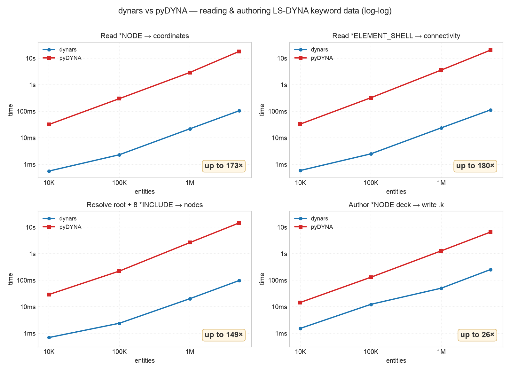

<p align="center">
  <picture>
    <source media="(prefers-color-scheme: dark)" srcset="assets/logo-dark.png">
    
  </picture>
</p>

<p align="center">
  <a href="https://osullivryan.github.io/dynars/"><b>Documentation</b></a> ·
  <a href="https://osullivryan.github.io/dynars/rust/dynars/">Rust API</a> ·
  <a href="https://osullivryan.github.io/dynars/python/dynars.html">Python API</a>
</p>

A fast LS-DYNA keyword file parser, written in Rust with Python bindings. It's
built for very large decks and does two things:

1. **Include-tree scanning.** Walks a deck's `*INCLUDE` graph across many files,
   in parallel, at memory-bandwidth speed.
2. **Keyword marshalling.** Indexes a file into keyword blocks, reads the
   high-volume keywords (`*NODE`, `*ELEMENT_*`) as columnar numpy arrays, edits
   keywords, and writes the deck back.

## Highlights

- **Fast.** The `*INCLUDE` scanner runs at about 15 GB/s per core (SIMD
  `memchr`) and spreads cross-file work over every core. Node marshalling parses
  around 73 M nodes/s on 10 cores.
- **Zero-copy to numpy.** Numeric columns (node coordinates, element
  connectivity) cross into Python as numpy arrays without a copy.
- **Handles the awkward formats.** Fixed-width (8-col), long (`*KEYWORD LONG`),
  and free (comma-separated) cards, plus Fortran floats like `1.5D+3` and
  `1.234-5`.
- **Callable from C and Fortran** over a C ABI (opt-in `ffi` feature).
- **Batch-aware.** A `Workspace` parses and validates many decks that share
  includes against one cache, so a common mesh is read and indexed once instead
  of once per deck (up to about 12x over a 32-deck batch).

## Performance

Measured on a 10-core Apple Silicon machine, 386 MB single-file deck, warm
cache. Methodology and scaling curves are under [Benchmarks](#benchmarks).

| Operation | Throughput |
|-----------|-----------|
| `*INCLUDE` scan, single large file (macOS, fault-bound) | ~15 GB/s |
| `*INCLUDE` scan, many warm files (mmap, no copy) | ~45 GB/s |
| Block index (mmap + split) | ~15 GB/s |
| Node parse, `#[derive(Keyword)]` (specialized) | ~70 M nodes/s |
| Node parse, builder / Python (interpreted) | ~57-64 M nodes/s |

Reading `*NODE` into typed arrays (the path behind `deck.table("NODE")`) puts
**100 M nodes under a second** and holds about 110 M nodes/s until it hits the
memory ceiling.


Reading a deck runs **100-200x faster than
[pyDYNA](https://github.com/ansys/pydyna)**, and authoring one runs about 25x
faster. Numbers and caveats are under [Versus pyDYNA](#versus-pydyna).

## Install

```bash
pip install dynars     # Python package (pulls in numpy)
cargo add dynars       # Rust library
cargo install dynars   # the `dynars` CLI
```

## Command line

```bash
dynars parse root.k          # print the include tree and throughput
dynars parse root.k --json   # the same, as JSON (pipe to jq)
dynars generate --depth 6 --breadth 4 --nodes 100000 --output test_output
```

## Python

### Include tree

```python
import dynars

root = dynars.parse_include_tree("root.k")
print(root.total_files(), root.total_bytes())
for child in root.children:
    print(child.path, child.kind, child.byte_count)
```

### Read and edit a keyword file

```python
import dynars

kf = dynars.parse_keyword_file("deck.k")
print(kf.num_blocks, kf.block_names())

nodes = dynars.parse_keyword(kf, "NODE")   # {"nid": int64[N], "x": ..., ...}

# Edit any of the ~2000 keywords, then write the deck back.
i = kf.block_names().index("MAT_ELASTIC")
cards = kf.keyword(i)["cards"]
cards[0][2] = "70000.0"                    # change Young's modulus
kf.set_keyword(i, "MAT_ELASTIC", cards)
kf.write("deck_edited.k")
```

### Author a keyword file from arrays

`write_keyword` is the reverse of `table`: numpy columns go straight into Rust,
no per-row Python objects.

```python
import numpy as np, dynars

n = 1_000_000
dynars.write_keyword("mesh.k", "NODE", {
    "nid": np.arange(1, n + 1, dtype=np.int64),
    "x": xs, "y": ys, "z": zs,
})
```

### Navigate and bulk-read off one handle

`parse_deck` reads the root and every `*INCLUDE` once. The `Deck` handles both
navigation (by id, following references) and bulk columnar reads, and it spans
every file.

```python
import dynars

deck = dynars.parse_deck("root.k")

nodes = deck.table("NODE")             # columns across the whole deck
shells = deck.table("ELEMENT_SHELL")

part = deck.part(1)
mat = part.material()                  # follow *PART.mid -> *MAT
print(part.field("secid"), mat.id if mat else None)
```

Rust does the same over one `Deck`:

```rust
use dynars::deck::parse_deck;

let deck = parse_deck(std::path::Path::new("root.k")).unwrap();

let nodes = deck.table("NODE").unwrap();
let ids = nodes.column("nid").unwrap().as_int().unwrap();

if let Some(part) = deck.part(1) {
    let secid = part.field("secid").and_then(|f| f.as_i64());
    let mat_id = part.material().and_then(|m| m.id());
    let _ = (ids, secid, mat_id);
}
```

### Validation

There's no default rule set. You pass the checks you want and get back findings,
each with a clickable `file:line`.

```python
import dynars
from dynars import Rule, Predicate, Cmp, Severity

deck = dynars.parse_deck("root.k")

report = deck.validate([
    Rule.references_resolve(),                                # ids resolve
    Rule.duplicate_ids(),                                     # no id collisions
    Rule.unreferenced_entities(),                             # dead defs (warns)
    Rule.field_forbidden_values("MAT_ELASTIC", "PR", [0.5]),  # PR may not be 0.5
    Rule.field_required(                                      # ELFORM==2 -> NIP>0
        "SECTION_SHELL",
        require=Predicate.field("NIP", Cmp.Gt, 0),
        when=Predicate.field("ELFORM", Cmp.Eq, 2),
    ),
    Rule.keyword_forbidden("MAT_ADD_EROSION").only_in(["submodel/"]),
])

print(report.is_clean(), report.count(Severity.Error))
for f in report.findings:
    print(f.severity, f.rule, f.location(), f.message)
```

The built-in rules are `references_resolve` (and
`references_resolve_with_connectivity`, which also checks that every element's
nodes exist), `duplicate_ids`, `unreferenced_entities`, `rigid_context`,
`include_missing`, `field_forbidden_values`, `field_required`, and
`keyword_forbidden`. Every rule takes `.only_in([...])` / `.except_in([...])`
file scopes and `.with_severity(...)`; compose predicates with `Predicate.all_ /
any_ / not_`.

Rust runs the same rules, and adds a custom `Check` for anything the built-ins
don't cover:

```rust
use dynars::validate::{Check, Deck, Finding, Rule, Severity};

struct DensityPositive;
impl Check for DensityPositive {
    fn name(&self) -> String { "density_positive".into() }
    fn run(&self, deck: &Deck) -> Vec<Finding> {
        deck.keywords("MAT_ELASTIC").filter_map(|m| {
            let ro = m.field("RO")?.as_f64()?;
            (ro <= 0.0).then(|| Finding {
                rule: self.name(), severity: Severity::Warning,
                keyword: "MAT_ELASTIC".into(), file: m.file().to_path_buf(),
                line: m.line(), message: format!("RO = {ro} must be positive"),
            })
        }).collect()
    }
}
let _ = deck.validate([Rule::references_resolve(), Rule::custom(DensityPositive)]);
```

### Workspace: many decks that share includes

Load-case or run variants of one model usually `*INCLUDE` the same big files. A
`Workspace` reads and indexes each shared file once across the batch, then
validates the decks in parallel. The decks it returns are ordinary `Deck`s, so
you can navigate or validate them one at a time and still reuse the cache.

```python
import dynars

ws = dynars.Workspace()
decks = ws.parse_decks(["variant_a/main.k", "variant_b/main.k", "variant_c/main.k"])

reports = ws.validate_decks(decks, [
    dynars.Rule.references_resolve_with_connectivity(),
    dynars.Rule.duplicate_ids(),
])
print(ws.stats())  # files_parsed vs files_reused, indices built once
```

The shared work is paid once, so the workspace total stays roughly flat as decks
are added while the per-deck approach grows linearly. Over a 28 MB shared mesh
(500k nodes, 500k shells):

| decks | naive total | workspace total | speedup |
|------:|------------:|----------------:|--------:|
| 4  | 240 ms  | 122 ms | 2.0x |
| 8  | 481 ms  | 126 ms | 3.8x |
| 16 | 969 ms  | 150 ms | 6.5x |
| 32 | 1944 ms | 157 ms | 12.4x |

A missing `*INCLUDE` is never parsed, so nothing phantom leaks into the deck.
Add `Rule.include_missing()` to catch it. Don't rely on `references_resolve`
alone: if the missing file was the only source of an entity kind, references to
that kind stay unflagged. See `examples/batch_validate.rs` and
`examples/batch_demo.py`.

### Result post-processing

Channels from a binout or d3plot come back as numpy arrays, so they feed straight
into signal processing and occupant injury criteria. These live in the Rust core
and are verified bit-exact against SciPy.

```python
import dynars

b = dynars.parse_binout("binout*")
dt = 1e-4

ax = dynars.cfc(b.read(["nodout", "d000001", "x_acceleration"]), 1000.0, dt)  # CFC1000
vel = dynars.integrate(ax, dt)
low = dynars.butterworth(ax, 4, 300.0, 1 / dt, "low")

a_res = dynars.resultant(ax_g, ay_g, az_g)   # sqrt(x^2 + y^2 + z^2)
hic36 = dynars.hic36(a_res, dt)              # also hic15, hic
a3ms  = dynars.clip(a_res, dt)               # 3 ms clip
csi   = dynars.severity_index(a_res, dt)     # Gadd severity index
```

Filtering (`cfc`, `filtfilt`, `butterworth`) is behind the `signal` feature,
which the published wheels include. CFC and the injury criteria are always
available. Generic array math (FFT, resampling) is left to numpy and SciPy.

## Custom keywords

Decks carry vendor, rare, or newer-than-our-snapshot keywords. Describe one with
a schema and it becomes first-class on the deck: columns, typed fields, and (in
Rust) reference checking. The declaration is data, run by the Rust hot loop, so
it never calls back into Python per card.

In Python, a keyword is a class. Fields on the class are one card; a `cards` list
composes several.

```python
from dynars import keyword, Card, Int, Float, IntArray, parse_keyword

@keyword("NODE")                      # one card, repeats over the block
class Node(Card):
    nid = Int(8)
    x = Float(16); y = Float(16); z = Float(16)

@keyword("ELEMENT_SHELL")
class ElementShell(Card):
    eid = Int(8); pid = Int(8)
    nodes = IntArray(4, width=8)      # one (N, 4) column

cols = parse_keyword(kf, Node)        # {"nid": int64[N], "x": float64[N], ...}
```

In Rust the equivalent is `#[derive(Keyword)]`. The field types imply
Int/Float/Str, so you only annotate widths.

```rust
use dynars::Keyword;

#[derive(Keyword)]
#[keyword("NODE")]                    // repeat defaults to true
struct Node {
    #[field(8)]  nid: i64,            // i64 -> Int, f64 -> Float, String -> Str
    #[field(16)] x: f64,
    #[field(16)] y: f64,
    #[field(16)] z: f64,
}

let nodes = Node::parse(&parsed);
let ids = nodes.column("nid").unwrap().as_int().unwrap();
```

To register a keyword on a whole `Deck` (so navigation, `table_with`, and the
rules see it), pass a runtime schema. In Rust a `ref_to` field also declares a
reference, so `references_resolve()` dangling-checks it.

```rust
use dynars::schema::{Schema, Card};
use dynars::keywords::EntityKind;

deck.register_schema(Schema::new("VENDOR_WIDGET").card(
    Card::new()
        .int("wid", 8)
        .float("mass", 8)
        .ref_to("mat", 8, EntityKind::Material),   // id references a *MAT
));
```

```python
cards = [[("wid", "int", 8, 1), ("mass", "float", 8, 1)]]
deck.register_schema("VENDOR_WIDGET", cards)
cols = deck.table_with("VENDOR_WIDGET", cards)
```

Runnable examples: `examples/schema_demo.{rs,py}`, `examples/derive_demo.rs`,
and `examples/builtin_demo.{rs,py}`.

### Built-in keyword library

You don't have to declare the common keywords. dynars ships schemas for about
**3,170 LS-DYNA keywords**, generated from the
[pyDYNA](https://github.com/ansys/pydyna) field database (`codegen/`), plus
hand-written `*NODE` and `*PART` that pyDYNA omits. Pass a name and it resolves
from the library:

```python
nodes = dynars.parse_keyword(kf, "NODE")
mats  = dynars.parse_keyword(kf, "MAT_ELASTIC")   # no declaration needed
```

A `@keyword` class or `#[derive(Keyword)]` with the same name overrides the
built-in. To avoid magic strings, every name is also a constant:
`dynars.kw.MAT_ELASTIC` in Python, `dynars::keywords::names::MAT_ELASTIC` in
Rust. The opt-in `typed-keywords` feature generates a typed struct per keyword.

The library covers each keyword's static card layout. Conditional or
count-driven cards (for example `*DEFINE_CURVE`) parse their base layout and
stay in the generic `Keyword` model.

## C / Fortran

The parse and validate path is exposed over a C ABI behind the opt-in `ffi`
feature. Fortran binds the same ABI through `iso_c_binding`. Marshalling,
navigation, and the result readers are Rust and Python only.

```bash
cargo build --release --features ffi
# target/release/libdynars.{dylib,so,a}
```

```c
#include "dynars.h"

DynarsDeck *deck = dynars_parse_deck("root.k");   // NULL on error
DynarsRuleSet *rules = dynars_ruleset_new();
dynars_ruleset_add_references_resolve(rules);
dynars_ruleset_add_include_missing(rules);

DynarsReport *report = dynars_deck_validate(deck, rules);
for (size_t i = 0; i < dynars_report_len(report); i++)
    printf("%s:%zu  %s\n", dynars_report_finding_file(report, i),
                           dynars_report_finding_line(report, i),
                           dynars_report_finding_message(report, i));

dynars_report_free(report);
dynars_ruleset_free(rules);
dynars_deck_free(deck);
```

Every handle is caller-owned and freed with its matching `*_free`; fallible
calls return `NULL`/`-1` and set a thread-local message read via
`dynars_last_error()`. The header is `examples/ffi/dynars.h`, with runnable C
and Fortran examples and a `Makefile` in `examples/ffi/`.

## Design

The two capabilities are separate, and marshalling is additive: the include-tree
path is unchanged and pays nothing for the marshalling features.

- **Scanner** (`parser::parse_file_from_path`): memory-maps the file and scans
  for `*` at line starts with SIMD `memchr`. Files 8 MB and up are scanned in
  parallel over line-aligned chunks; the mapping is contiguous, so a chunk that
  finds a keyword near its end reads forward for the filename and needs no
  overlap buffer. Across files, a work-stealing pool parallelizes by file.
- **Block index** (`parser::parse_file_blocks`): memory-maps the file and splits
  it into keyword blocks that tile the source exactly. That's the lossless
  round-trip guarantee: re-emitting every block reproduces the input. Edits are
  an overlay keyed by block index.
- **Tokenizer** (`Field`, `split_fields`, `CardIter`): lazy, format-aware field
  splitting. Nothing is parsed until read.
- **Schemas** (`schema`, `dynars-derive`): the single columnar path. A
  declarative card layout is parsed into `Table`s, parallelized with rayon over
  line-aligned chunks, using `lexical` for fast conversion and mapping straight
  onto numpy. Three front ends lower to one `Schema`: the Rust builder,
  `#[derive(Keyword)]` structs, and the Python `@keyword` classes.

Fixed-width is the default. Long format is detected from `*KEYWORD LONG=Y|S`.
Free format is decided per line: a line switches to comma-splitting the moment it
contains a comma, matching LS-DYNA's own rule.

Parallel mmap scanning scales on Linux, where page faults resolve concurrently.
On macOS minor faults serialize, so single-file scans there run near
single-thread speed, though eliminating the copy still helps.

## Benchmarks

The [throughput table](#performance) was measured on a 10-core Apple Silicon
machine, 386 MB single-file deck (5 M nodes), warm cache. A few notes:

- `#[derive(Keyword)]` emits monomorphized code (offsets known at compile time),
  so its `parse()` runs about 20% faster than the interpreted builder and Python
  path. Both do tens of millions of entities per second.
- The multi-file scan number roughly doubled after switching from `read()` to
  `mmap`, which removes a copy of every file.
- Cold decks larger than RAM are limited by disk bandwidth (about 2 GB/s
  sustained NVMe), not CPU. The scanner is about 7x faster than the disk can
  deliver bytes.

### Versus pyDYNA

[pyDYNA](https://github.com/ansys/pydyna) (`ansys-dyna-core`) is a deck-authoring
API in pure Python and pandas that also reads keyword files. Same machine, same
decks, both going between arrays and a deck (pyDYNA 0.12.1):



| Task, 1 M entities | dynars | pyDYNA | speedup |
|---|---:|---:|---:|
| Read `*NODE` into `(N, 3)` coords | 22 ms | 2.9 s | **~130x** |
| Read `*ELEMENT_SHELL` into `(M, 4)` connectivity | 24 ms | 3.6 s | **~150x** |
| Root + 8 `*INCLUDE` into all node coords | 20 ms | 2.6 s | **~130x** |
| Author a `*NODE` deck and write `.k` | 50 ms | 1.3 s | **~26x** |

Reading stays 150-180x ahead at 5 M entities; authoring stays around 26x. Two
things to be fair about. pyDYNA builds a pandas DataFrame per keyword, which is
its data model. And it doesn't follow `*INCLUDE`, so that row compares dynars'
native `parse_deck` against a recursive loader written over pyDYNA. Authoring
uses dynars' `write_keyword`; the older per-card path was about 25x slower, which
is why the columnar writer exists.

```bash
pip install ansys-dyna-core
python examples/compare_pydyna.py     # writes assets/bench_pydyna.csv
python scripts/plot_bench.py          # writes assets/perf_pydyna.png
```

### Scaling across include layouts

Every pipeline stage is linear in deck size and parallel across include files.
The figure sweeps deck size for three include layouts: one monolithic file, a
wide flat tree (256 leaves), and a deep tree (216 leaves, 3 levels). Shared
log-log axes.


At the top point, a 5 M-keyword, 1.1 GB deck:

- Every stage is linear on log-log across about 1.6 decades.
- Spreading a deck over include files fans work across cores. The reference plus
  connectivity check drops from 1.39 s to 0.23 s (1 file to 256), the reference
  check from 0.99 s to 0.16 s, and reading the deck from 160 ms to 46 ms.
- Include depth is nearly free: the flat and 3-deep trees track each other.
- The field-value check is the one sequential stage, since a keyword's
  occurrences are scanned in order.

```bash
cargo run --release --example bench_scaling   # assets/bench_scaling.csv
cargo run --release --example marshal_bench   # assets/bench_marshal.csv
python scripts/plot_bench.py                  # renders assets/perf_*.png
```

## Development

```bash
cargo test                    # Rust unit and integration tests
cargo check --features python # type-check the pyo3 bindings

# Regenerate the Python type stub after changing the API.
maturin generate-stubs --features python --out python/dynars
```

## Status

Speed is mature. The open frontier is correctness coverage on real decks:
long-format field widths, multi-line element cards, and per-keyword field schemas
for the generic splitter. Validating against representative customer `.k` files
is the highest-value next step.
